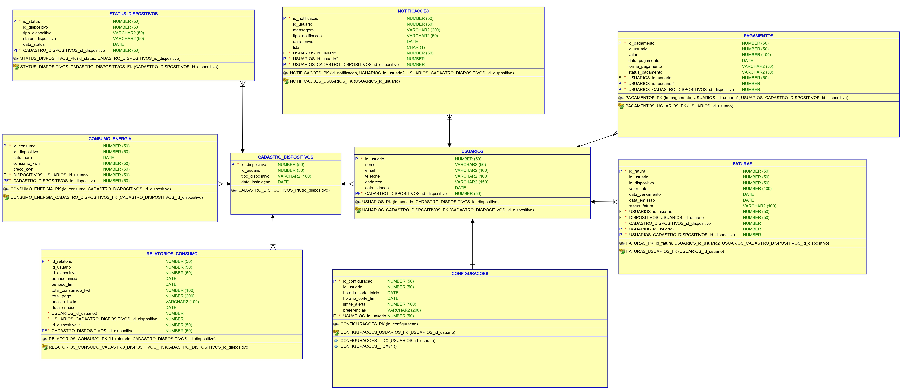

# SICE: Solução Inteligente para Controle Energético

## **Introdução**  
A Global Solution, este ano, firmou parcerias com diversas empresas líderes no setor de energias renováveis e limpas no atual cenário mundial. O objetivo é que as turmas da FIAP proponham uma solução tecnológica ou até mesmo um modelo de negócio que tenha impacto positivo nessa área, abordando não apenas questões energéticas, mas também promovendo justiça social e crescimento econômico.

### Link do Vídeo da Proposta Tecnológica

[Link do vídeo.](https://www.youtube.com/watch?v=yUlYOG-bqCk&ab_channel=Jo%C3%A3oPedro)

## **Objetivo**  
O **SICE (Solução Inteligente para Controle Energético)** é um dispositivo inovador que atua como uma central de monitoramento de energia para locais comerciais e residenciais. Ele busca promover a eficácia energética, evitando desperdícios e contribuindo para a sustentabilidade ambiental. Além disso, oferece maior transparência no gerenciamento da relação gasto/consumo.  

### **Funcionalidades**  
- **Corte de luz sem a necessidade de funcionário**  
  Um Arduino conectado ao dispositivo, localizado antes do relógio de luz, permite interromper ou restaurar o fornecimento de energia através de um relé eletrônico. Essa funcionalidade é útil tanto para inadimplência quanto para emergências ou manutenções programadas.  

- **Avisos diretos ao residente ou proprietário**  
  O dispositivo envia notificações sobre o consumo de energia, pendências financeiras e alertas de alto consumo diretamente ao usuário.  

- **Pagamento direto no equipamento**  
  Possibilidade de pagar a conta de energia diretamente no dispositivo, aceitando diversas formas de pagamento, eliminando a necessidade de deslocamento até lotéricas ou bancos.  

- **Relatórios detalhados e análise preditiva**  
  Com base em análise preditiva de dados, o SICE fornece relatórios detalhados do consumo energético, exibindo dados históricos e tendências de uso para ajudar na tomada de decisão.  

## **Diferenciais**  
O **SICE** foi projetado para se adaptar a diferentes portes de empresas, desde pequenas até grandes corporações. Sua instalação é padronizada, facilitando a integração, independentemente do local ou ambiente. Além disso:  
- Não requer treinamento específico para sua utilização.  
- Representa um investimento com retorno, permitindo a redução de custos operacionais e o aumento do crescimento econômico.  
- Possui alta escalabilidade e pode ser facilmente integrado com fontes de energia renováveis, como painéis solares.  

## **Público-alvo**  
- Empresas de pequeno, médio e grande porte que buscam reduzir custos e melhorar a eficiência energética.  
- Residências, especialmente aquelas que utilizam fontes de energia renováveis, como painéis solares.  

## **Descrição do Sistema**  
O sistema que suporta o **SICE** consiste em:  
- Uma **API Spring Boot** em Java, que realiza as operações de criação, atualização, exclusão e consulta dos dados da plataforma.
- API permite manipular o nível de acesso entre usuário e admins para manipulação de diferentes dados.
- Banco de dados relacional **Oracle**, responsável pelo armazenamento seguro e eficiente das informações.

## **Intruções para Rodar a Aplicação**  

O usuário deve rodar a classe `GlobalSolutionApplication`, visto que o banco de dados Oracle já está criado e com as tabelas configuradas. O usuário e senha são automaticamente passados na `application.properties`, não sendo necessário rodar o programa com parâmetros.

Com a aplicação rodando, o usuário pode acessar a interface Swagger em [http://localhost:8080/swagger-ui/index.html#/](http://localhost:8080/swagger-ui/index.html#/).

### **Credenciais de Acesso**  
- **Administrador:** `admin` / `admin` (acesso total a todas as requisições)
- **Usuário comum:** `user` / `password` (acesso restrito a algumas requisições)

[Vídeo explicativo.](https://youtu.be/uTedHQRiVjk)

## Tecnologias e Funcionalidades Utilizadas

- **Spring Boot**: Framework para desenvolvimento de APIs RESTful com configuração automática e simplificada.
- **JPA (Java Persistence API)**: Mapeamento de objetos Java para tabelas no banco de dados, simplificando o acesso e persistência de dados.
- **Swagger/OpenAPI**: Documentação automática da API com interface interativa, permitindo testar os endpoints diretamente.
- **Paginação**: Implementação de paginação para limitar a quantidade de dados retornados nos endpoints, utilizando `Pageable` e `PageRequest`.
- **HATEOAS**: Inclusão de links dinâmicos de auto-descoberta nos recursos, para permitir a navegação entre os endpoints de forma intuitiva.
- **Spring Security**: Controle de acesso e autenticação, garantindo que apenas usuários com permissões apropriadas acessem determinados recursos.
- **Validação de Dados**: Validação automática dos dados de entrada nas requisições, usando anotações como `@Valid` e `@NotNull`.
- **Mapeamento de Dados (DTO)**: Mapeamento entre entidades do banco de dados e objetos de transferência de dados (DTOs), utilizando bibliotecas como `MapStruct` ou `ModelMapper`.
- **RESTful API**: Estrutura de construção de APIs que seguem os princípios do REST, utilizando métodos HTTP (`GET`, `POST`, `PUT`, `DELETE`).
- **Autenticação e Autorização**: Controle de acesso com base em JWT ou sessões, garantindo que apenas usuários autenticados possam acessar certos recursos.
- **Testes Automatizados**: Garantia de qualidade e funcionamento da aplicação através de testes automatizados com frameworks como `JUnit` e `Mockito`.

## Principais Endpoints

1. **Criar Recurso**
   - **Método**: `POST`
   - **Descrição**: Cria um novo recurso de acordo com os dados fornecidos.
   - **Exemplo de URL**: `/api/recurso`

2. **Buscar Todos os Recursos**
   - **Método**: `GET`
   - **Descrição**: Retorna uma lista de todos os recursos, com suporte à paginação.
   - **Exemplo de URL**: `/api/recurso?page=0&size=10`

3. **Buscar Recurso por ID**
   - **Método**: `GET`
   - **Descrição**: Busca um recurso específico por seu ID.
   - **Exemplo de URL**: `/api/recurso/{id}`

4. **Atualizar Recurso**
   - **Método**: `PUT`
   - **Descrição**: Atualiza um recurso existente de acordo com os dados fornecidos.
   - **Exemplo de URL**: `/api/recurso/{id}`

5. **Excluir Recurso**
   - **Método**: `DELETE`
   - **Descrição**: Exclui um recurso existente.
   - **Exemplo de URL**: `/api/recurso/{id}`

## Diagrama de classe

## DER

## Autores

- **João Pedro Fontana Villagra | RM 553343**  
  •  [LinkedIn](https://www.linkedin.com/in/joaopfvillagra/)

- **Vinicius Malavia Lorenzetti | RM 553121**  
   • [LinkedIn](https://www.linkedin.com/in/vinicius-lorenzetti-b9b761260/)

- **Marcelo Mendes Galli | RM 553654**  
  •  [LinkedIn](https://www.linkedin.com/in/marcelo-galli/)

